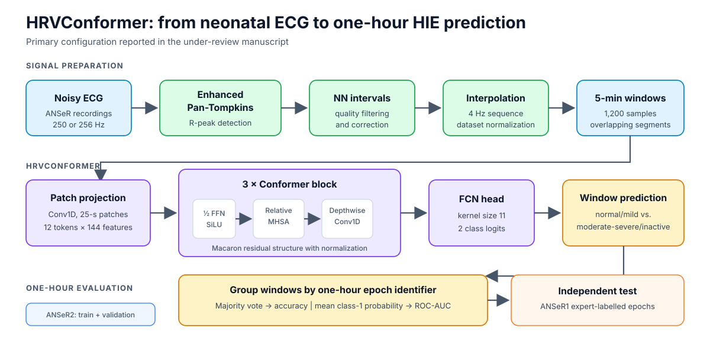
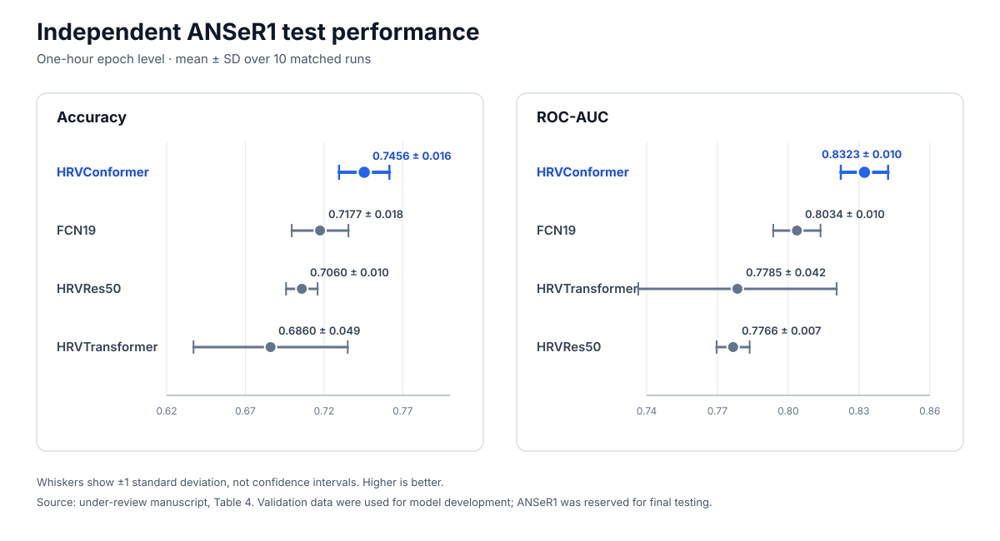

# HRVConformer

[](https://arxiv.org/abs/2605.26190)
[](https://github.com/syu-kylin/HRVConformer/actions/workflows/ci.yml)
[](LICENSE)

Official PyTorch implementation of **HRVConformer**, a convolution-augmented Transformer for binary neonatal hypoxic-ischemic encephalopathy (HIE) classification from five-minute, interpolated Normal-to-Normal (NN) interval signals.

> **Publication status.** The manuscript *Neonatal Hypoxic-Ischemic Encephalopathy Classification from Heart Rate Variability Using a Convolution-Augmented Transformer* is under review at *Engineering Applications of Artificial Intelligence* (EAAI). The public preprint is [arXiv:2605.26190](https://arxiv.org/abs/2605.26190). The journal manuscript contains later analyses and may differ from arXiv v1. Please cite the public preprint until a version of record is available.



*Figure 1. Repository-native overview of signal preparation, the primary HRVConformer configuration, and one-hour epoch aggregation. The enhanced Pan-Tompkins implementation is maintained separately.*

## Highlights

- End-to-end learning from interpolated NN-interval time series, without handcrafted HRV features.
- Convolution modules capture local structure while multi-head attention models longer-range dependencies.
- Weak and expert labels from ANSeR2 are used for development; expert-labelled ANSeR1 data form an independent test cohort.
- Window predictions are aggregated to the one-hour epoch level: majority vote for accuracy and mean positive-class probability for ROC-AUC.

## Reported results

The under-review manuscript reports the following one-hour epoch-level results over ten matched runs (mean +/- standard deviation):

| Model | Test accuracy | Test ROC-AUC |
|---|---:|---:|
| **HRVConformer** | **0.7456 +/- 0.016** | **0.8323 +/- 0.010** |
| FCN19 | 0.7177 +/- 0.018 | 0.8034 +/- 0.010 |
| HRVTransformer | 0.6860 +/- 0.049 | 0.7785 +/- 0.042 |
| HRVRes50 | 0.7060 +/- 0.010 | 0.7766 +/- 0.007 |



*Figure 2. One-hour epoch-level performance on the independent ANSeR1 test cohort. Points and whiskers show mean +/- one standard deviation over ten matched runs; whiskers are not confidence intervals. Values are from Table 4 of the under-review manuscript.*

These are research results on the study cohorts, not estimates of clinical utility. See the manuscript for cohort definitions, statistical comparisons, calibration, ablations, attention analysis, and limitations.

## Repository scope

This repository contains the HRVConformer model, training loop, evaluation code, epoch-level aggregation, and experiment plotting utilities. The improved Pan-Tompkins implementation used upstream is maintained separately at [syu-kylin/enhanced-Pan-Tompkin](https://github.com/syu-kylin/enhanced-Pan-Tompkin).

Clinical recordings, derived patient-level data, trained checkpoints, and baseline implementations are not distributed here. See [DATA.md](DATA.md) for access constraints and the expected preprocessed format. See [REPRODUCIBILITY.md](REPRODUCIBILITY.md) for the manuscript configuration and interpretation of the evaluation protocol.

## Installation

Python 3.11 and an NVIDIA CUDA-capable environment are recommended for full training.

```bash
git clone https://github.com/syu-kylin/HRVConformer.git
cd HRVConformer
python -m venv .venv
source .venv/bin/activate
python -m pip install --upgrade pip
python -m pip install -r requirements.txt
```

CPU execution is useful for smoke tests but is not representative of the manuscript training setup.

## Data preparation

After obtaining authorized access and producing the preprocessed MATLAB files described in [DATA.md](DATA.md), point the code to their parent directory:

```bash
export HRVCONFORMER_DATA_ROOT=/absolute/path/to/RPeaks
```

The path can instead be supplied with `--data_root`. Patient data should remain outside the Git repository.

## Training

The checked-in command-line defaults now match the primary HRVConformer configuration in the under-review manuscript:

```bash
python main.py \
  --data_root /absolute/path/to/RPeaks \
  --device cuda \
  --pin_memory \
  --save_model \
  --job_name paper \
  --group_name HRVConformer
```

Use `python main.py --help` to inspect all model, optimization, data, logging, and distributed-training options. For multi-GPU execution, launch with `torchrun` and add `--distributed --dist_eval`.

Weights & Biases logging is opt-in with `--wandb_enable`; no data are sent by default. Outputs are written beneath `--outdir` (default: `./log`).

## Model-only smoke test

The architecture can be checked without access to clinical data:

```bash
python -m model.ConformerNet
python -m pytest -q
```

Expected model input shape is `(batch, 1, 1200)`: one five-minute NN-interval window sampled at 4 Hz. The output contains two class logits.

## Code map

| Path | Purpose |
|---|---|
| `model/ConformerNet.py` | Patch projection, Conformer stack, and classifier selection |
| `model/ConformerBlock.py` | Feed-forward, relative-attention, and convolution modules |
| `data_loader.py` | Private preprocessed-data loading, development split, normalization, and window dataset |
| `main.py` | Training orchestration, checkpoint selection, and experiment logging |
| `train_func.py` | Window-level optimization and evaluation |
| `matrix.py` | Window- and one-hour epoch-level ROC-AUC |
| `postprocessing.py` | One-hour epoch aggregation and run summaries |
| `project_init.py` | Reproducible command-line configuration |

## Citation

Citation metadata are provided in [CITATION.cff](CITATION.cff). Until a journal version of record is published, cite:

```bibtex
@article{yu2026hrvconformer,
  title   = {HRVConformer: Neonatal Hypoxic-Ischemic Encephalopathy Classification from the Heart Rate signals},
  author  = {Yu, Shuwen and Marnane, William P. and Boylan, Geraldine B. and Lightbody, Gordon},
  journal = {arXiv preprint arXiv:2605.26190},
  year    = {2026},
  url     = {https://arxiv.org/abs/2605.26190}
}
```

## Responsible use

This is research software, not a medical device or clinical decision-support system. It has not been validated for prospective clinical use. Do not use its outputs to diagnose HIE, determine therapeutic hypothermia eligibility, or replace EEG assessment or qualified clinical judgement.

## Contributing and license

Bug reports and focused reproducibility improvements are welcome; see [CONTRIBUTING.md](CONTRIBUTING.md). The code is released under the [MIT License](LICENSE). Dataset access and use remain governed by the original studies, ethics approvals, institutional agreements, and applicable data-protection requirements.
